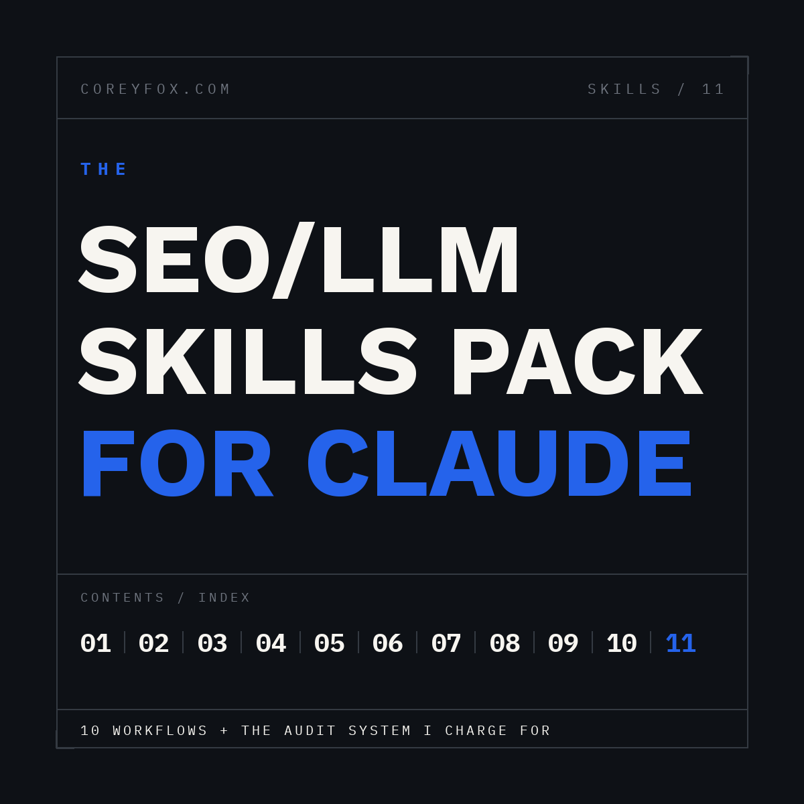

# claude-aeo: Answer Engine Optimization for Claude

**claude-aeo makes brands the answer AI engines give.** 12 skills (1 orchestrator + 11 specialists) covering AI visibility auditing, citation testing across ChatGPT / Perplexity / Google AI Overviews, AEO content restructuring, JSON-LD schema, E-E-A-T scoring, AI-risk keyword classification, competitor entity gaps, internal linking, content briefs, and local posts.

Built by a working AEO consultant. The flagship skill, `aeo-visibility-audit`, is the exact report generator behind paid client audits: it turns raw data into a client-ready deliverable with a dollar figure, a 5-query citation scorecard, named competitors, and three ranked fixes.

**Works on both Claude surfaces.** Install as a Claude Code plugin, or upload the pre-zipped skills natively in claude.ai (Settings > Capabilities, then Customize > Skills). No terminal required for the claude.ai path.

## Why this exists

SEO plugins audit websites. This one runs an AEO practice:

- **Revenue framing, not ranking framing.** Every audit output prices the visibility gap in dollars at Google Ads market rates. Rankings are an input; the deliverable speaks the language a business owner funds.
- **The citation test is the core primitive.** Five bottom-funnel buyer queries, tested fresh across three engines, scored X of 5. That number is what changed between 2024 SEO and now, and no crawler produces it.
- **Deliverables, not just findings.** The output of `/aeo audit` is a document a consultant sends a client, with an honesty rule built in: the verdict section is allowed to say "do not buy a retainer." Every claim must trace to an input; missing data reads "insufficient data," never an estimate.
- **Zero infrastructure.** No API keys, no crawler setup, no Python environment. The skills reason over data you paste: exports, page source, keyword lists, query test results. That is a constraint and a feature: it runs anywhere Claude runs, including your phone.

## Install

### claude.ai / Claude apps (no terminal)

1. Settings: turn on **Code Execution and File Creation** (Pro, Max, Team, Enterprise)
2. **Customize > Skills > +**, upload each ZIP from [`releases/claude-ai-zips/`](releases/claude-ai-zips/)
3. Toggle on. Claude now loads the right skill automatically when a task matches; "would ChatGPT cite this page?" triggers `aeo-visibility-check` on its own.

### Claude Code (plugin)

```
/plugin marketplace add KingForm242/claude-aeo
/plugin install claude-aeo@KingForm242-claude-aeo
```

### Claude Code (manual)

```
git clone https://github.com/KingForm242/claude-aeo.git
cd claude-aeo && ./install.sh
```

## Commands

| Command | What it does |
|---|---|
| `/aeo audit` | Client-ready AI Visibility Audit report from your collected data (the flagship) |
| `/aeo site <url or crawl data>` | Technical + on-page audit, prioritized fix table |
| `/aeo check <query + content>` | Would an LLM cite this page? Weighted scorecard + rewritten opening |
| `/aeo optimize <query + content>` | Restructure content to earn AI citations |
| `/aeo schema <page>` | Valid JSON-LD for any page type, validation checklist |
| `/aeo eeat <content>` | E-E-A-T score with PUBLISH / REVISE / REWRITE verdict |
| `/aeo intent <keyword list>` | Intent + buyer stage + AI answer risk classification |
| `/aeo gap <yours + competitor>` | Entity-level gap report vs the page outranking you |
| `/aeo links <page list>` | Hub-and-spoke internal linking map with exact anchors |
| `/aeo brief <keyword>` | Writer-ready brief, AEO answers included |
| `/aeo gbp <business + topic>` | Three GBP post variations |

Or skip commands entirely: describe the task and the right skill loads from its description. That is how Skills work now.

## The consultant workflow

The chain this plugin was built around, start to finish:

1. **Collect** (8 minutes): traffic value delta from your SEO tool, 5-query citation test run fresh in ChatGPT / Perplexity / AI Overviews, three technical checks
2. `/aeo audit` with the four input blocks: the client report generates
3. `/aeo eeat` on the report itself as a QA pass
4. Send within 24 hours

New client onboarding: `site -> check -> gap -> intent -> brief x5`. Content refresh: `eeat -> optimize -> schema -> check`.

## Compared to claude-seo

[claude-seo](https://github.com/AgriciDaniel/claude-seo) is an excellent open-source SEO analysis plugin: 25 sub-skills, 18 parallel agents, headless rendering, provider extensions. If you want deep automated technical crawling inside Claude Code, use it. Genuinely.

Different jobs:

| | claude-aeo | claude-seo |
|---|---|---|
| Primary job | AI citation visibility + client deliverables | Site analysis and audits |
| Surfaces | Claude Code + native claude.ai uploads | Claude Code |
| Output | Client-ready reports with dollar figures | Prioritized findings and action plans |
| Setup | None; paste your data | Python scripts, optional API extensions |
| Built by | A practicing AEO consultant, from paid engagements | Open-source SEO engineering community |
| Best for | Consultants, agencies, in-house marketers without terminals | Developers and technical SEOs in the CLI |

Run both. They do not compete for the same hour of your day.

## FAQ

**Does this need API keys or MCP servers?** No. Skills reason over pasted data. If you have Ahrefs or similar connected via MCP, the skills will happily use that data when you provide it, but nothing is required.

**Does it work with the free Claude plan?** The Claude Code path and Projects fallback work broadly; native claude.ai Skill uploads require Pro or above.

**Where did these skills come from?** A working consulting practice. The guide version of this pack, with full walkthroughs and chaining playbooks, is free: [coreyfox.com/skills-pack](https://coreyfox.com/skills-pack/)

**Can you run the audit on my site?** That is literally the business. Free 8-minute version: [coreyfox.com/ai-visibility-audit](https://coreyfox.com/ai-visibility-audit/), your citation gap in dollars, no pitch.

## License

MIT. Use it, fork it, ship it to clients.

## Author

**Corey Fox**, senior technical SEO and AEO consultant. Mid-market e-commerce and B2B SaaS.
[coreyfox.com](https://coreyfox.com) | [Free AI Visibility Audit](https://coreyfox.com/ai-visibility-audit/) | [The full Skills Pack guide](https://coreyfox.com/skills-pack/)
"# claude-aeo" 
"# claude-aeo" 
"# claude-aeo" 
